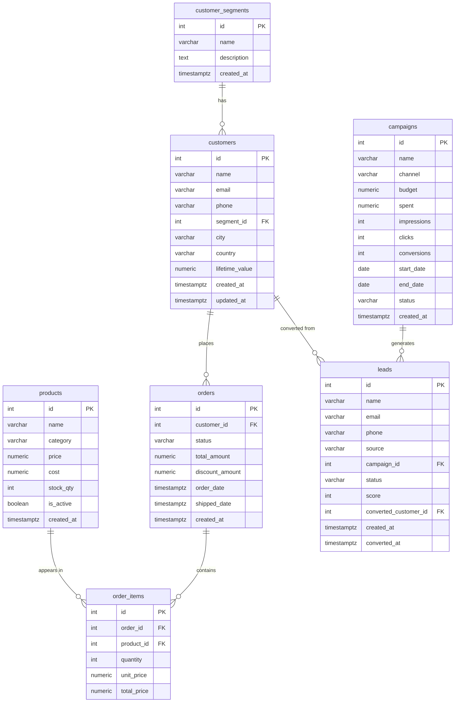

# Entity Relationship Diagram

## Key Relationships

| Relationship | Cardinality | Notes |
|---|---|---|
| `customer_segments` → `customers` | 1:N | Each customer belongs to one segment |
| `customers` → `orders` | 1:N | A customer can have many orders |
| `orders` → `order_items` | 1:N | Each order has one or more line items |
| `products` → `order_items` | 1:N | A product can appear in many order items |
| `campaigns` → `leads` | 1:N | A campaign generates many leads |
| `leads` → `customers` | N:1 (optional) | A converted lead becomes a customer |

## Analytics Queries Enabled

- **Revenue** — `SUM(orders.total_amount)` grouped by month, segment, product
- **Product performance** — `JOIN order_items ON products` → revenue, volume
- **Customer LTV** — `customers.lifetime_value` or computed from orders
- **Campaign ROI** — `campaigns.conversions / campaigns.spent`
- **Lead funnel** — `leads.status` counts by `source`, `campaign_id`
- **Segment analysis** — `JOIN customers ON customer_segments`
