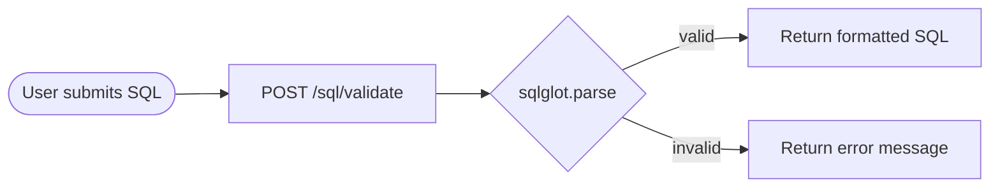

# Application Flowchart

## Request Flow

```mermaid
flowchart TD
    A([User types question]) --> B[QuestionInput]
    B --> C[POST /chat/query]

    subgraph Frontend
        B
        D[LoadingSteps UI]
        E[MessageList]
        F{Result Tabs}
        G[Answer Tab]
        H[Table Tab — TanStack]
        I[Chart Tab — Recharts]
        J[SQL Tab — SqlViewer]
        K[Follow-up Questions]
    end

    subgraph Backend — FastAPI
        C --> L{LLM Provider}
        L -->|mock| M[mock_llm.py]
        L -->|gemini| N[llm_provider.py — future]
        L -->|groq| N
        M --> O[QueryResponse]
        N --> O
    end

    subgraph Database
        P[(PostgreSQL)]
        Q[customers]
        R[orders / order_items]
        S[products]
        T[campaigns / leads]
    end

    O --> E
    E --> F
    F --> G
    F --> H
    F --> I
    F --> J
    G --> K
    K -->|click| A

    M -.->|future: real queries| P
    P --- Q & R & S & T
```

## SQL Validation Flow



## Component Tree

```
ChatPage (Server Component)
└── ChatPageClient (Client — reads ?q= param)
    └── ChatPanel (Client — owns state)
        ├── SuggestedQuestions  (shown when empty)
        ├── MessageList
        │   ├── UserBubble
        │   └── AssistantMessage
        │       ├── LoadingSteps    (while fetching)
        │       └── ResultBlock     (after response)
        │           ├── Tabs
        │           │   ├── Answer tab
        │           │   ├── Table tab → ResultTable (TanStack)
        │           │   ├── Chart tab → ResultChart (Recharts)
        │           │   └── SQL tab   → SqlViewer
        │           └── FollowUpQuestions
        └── QuestionInput
```
