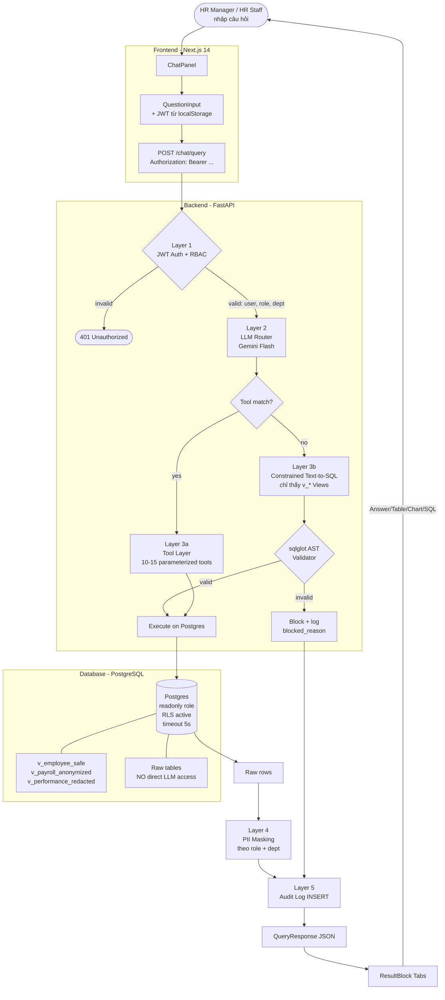
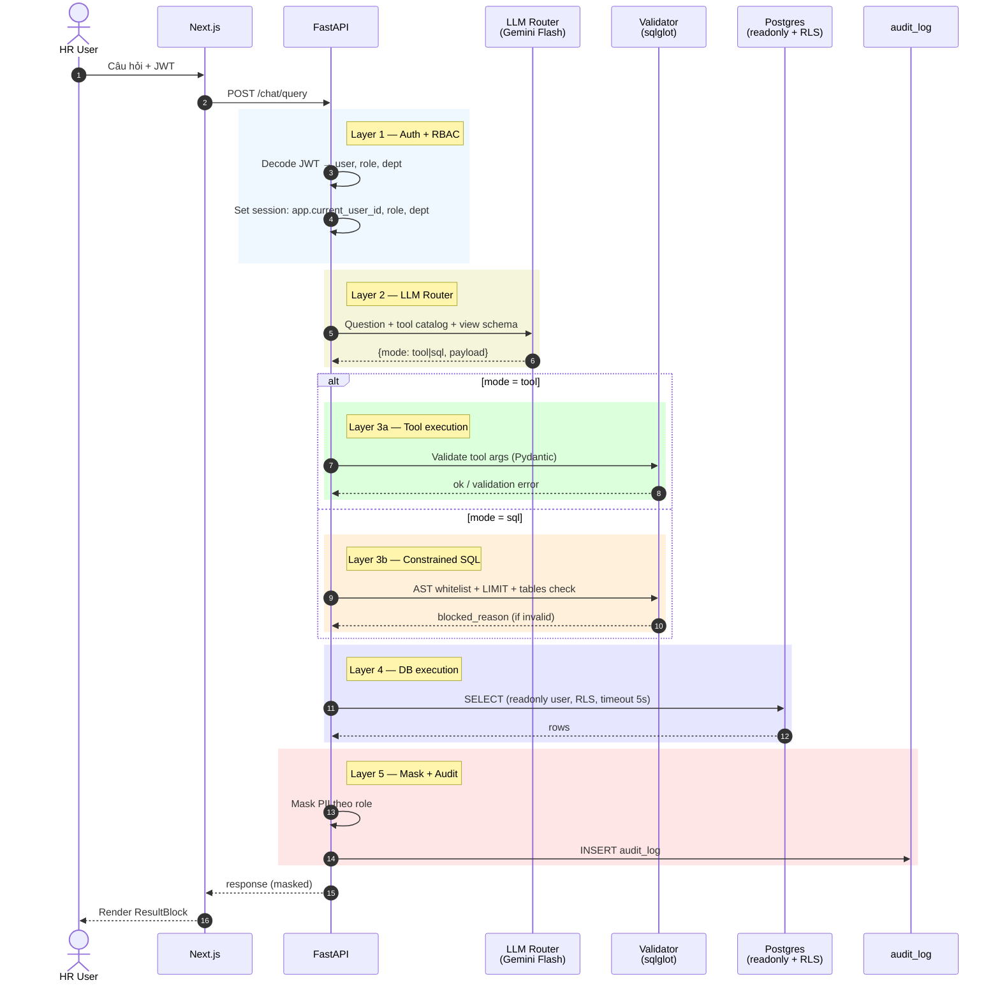
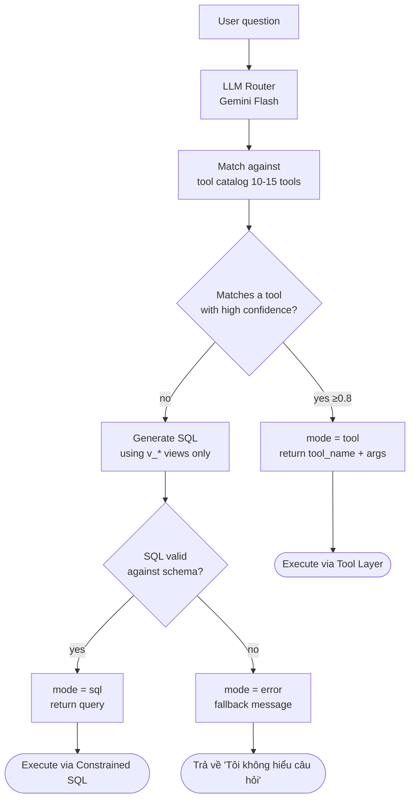
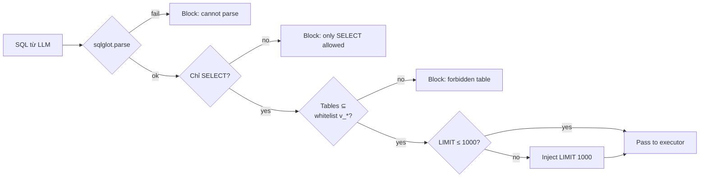
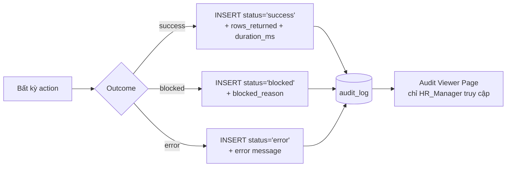

# Application Flowchart — HR ChatBI Architecture

Sơ đồ luồng cho HR ChatBI Assistant. Phản ánh kiến trúc 5-layer security đã chốt trong `01-project-scope.md`. Mỗi câu hỏi của user đi qua đầy đủ 5 layer trước khi trả về kết quả.

---

## 1. Request Flow (End-to-End)



---

## 2. Security Layers — Sequence Diagram



---

## 3. LLM Router Decision Tree



---

## 4. SQL Validation Flow (chi tiết Layer 3b)



---

## 5. Frontend Component Tree

```
ChatPage (Server Component)
└── AuthGuard (verify JWT, redirect /login if absent)
    └── ChatPageClient (Client — reads ?q= param + auth context)
        └── ChatPanel (Client — owns state)
            ├── RoleBadge              (HR_Manager / HR_Staff indicator)
            ├── SuggestedQuestions     (HR-specific: headcount, leave, salary…)
            ├── MessageList
            │   ├── UserBubble
            │   └── AssistantMessage
            │       ├── LoadingSteps          (while fetching)
            │       ├── BlockedQueryNotice    (if Layer 3b blocked → show reason)
            │       └── ResultBlock
            │           ├── Tabs
            │           │   ├── Answer tab
            │           │   ├── Table tab → ResultTable (TanStack)
            │           │   ├── Chart tab → ResultChart (Recharts)
            │           │   └── SQL tab   → SqlViewer
            │           ├── PIIMaskedBadge    (nếu có cột bị mask)
            │           └── FollowUpQuestions
            └── QuestionInput
```

---

## 6. Audit Log Flow

Mọi action — kể cả failed/blocked — đều ghi vào `audit_log`:



---

## 7. Mapping Layers → Code Location

| Layer | Mục đích | Code path | Trạng thái Week 1 |
|---|---|---|---|
| L1 — Auth/RBAC | JWT verify, set RLS context | `app/middleware/auth.py` | TODO Week 6 |
| L2 — LLM Router | Tool vs SQL decision | `app/services/router.py` | TODO Week 4 |
| L3a — Tool Layer | Parameterized tools | `app/tools/*.py` | TODO Week 3 |
| L3b — Constrained SQL | sqlglot AST validator | `app/services/sql_validator.py` | TODO Week 5 |
| L4 — Mask + Exec | PostgreSQL + masking | `app/db/session.py` + `app/services/mask.py` | Foundation Week 1 ✅ |
| L5 — Audit | Insert audit_log | `app/repositories/audit_repo.py` | Foundation Week 1 ✅ |

> **Note**: Week 1 chỉ build foundation cho L4 + L5. Các layer còn lại lần lượt từ Week 3-6.
